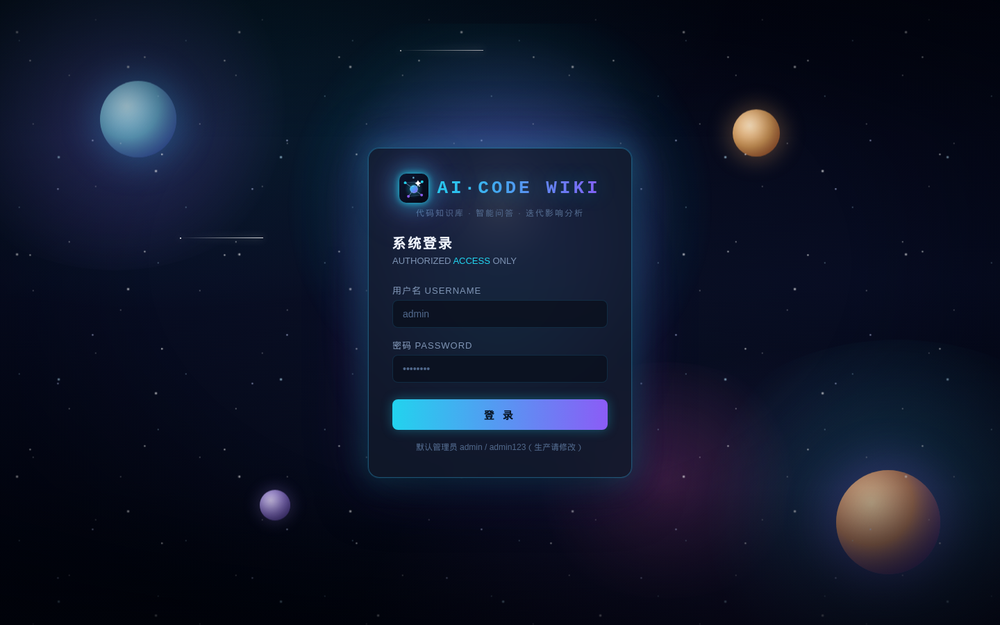
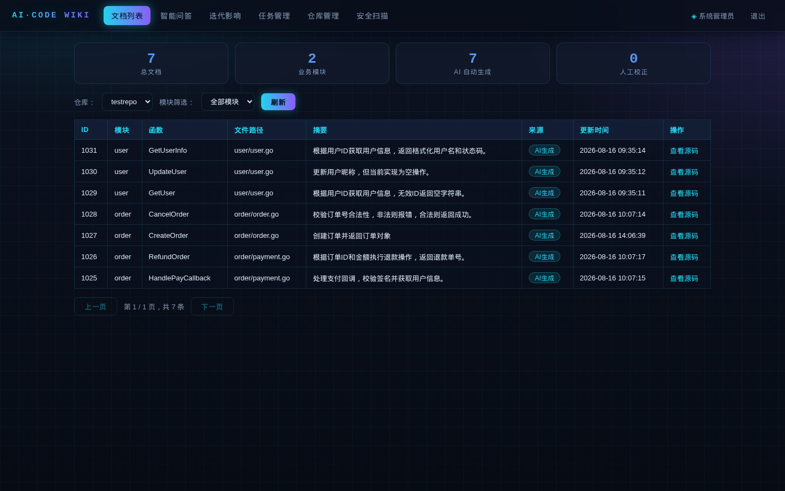
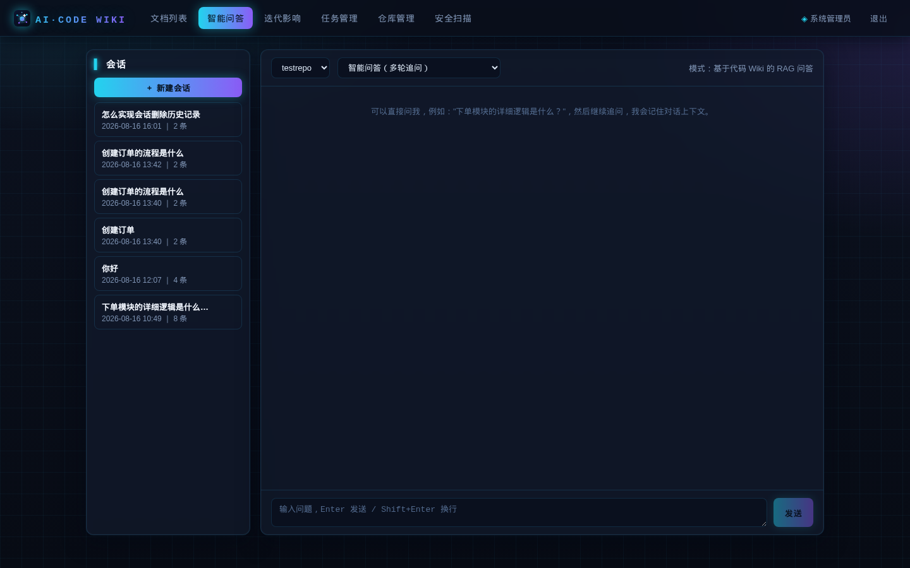
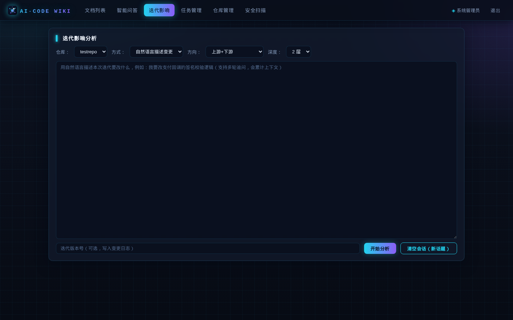
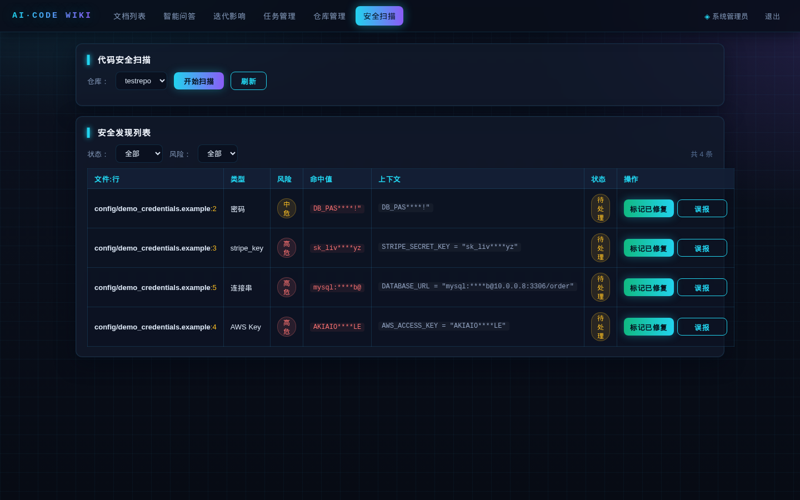
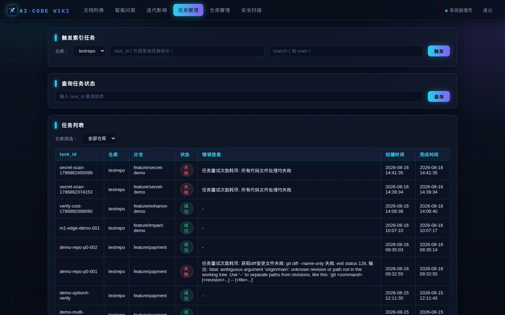
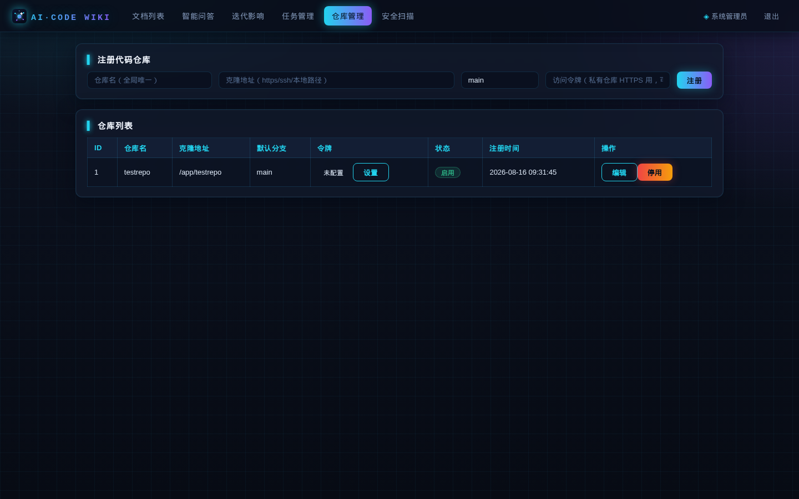

<div align="center">


# AI·CODE WIKI

**AI 驱动的代码知识库：代码 → 业务文档 → 智能问答 / 影响分析 / 安全扫描**

基于 CI 增量解析，把仓库代码自动沉淀为函数级业务文档知识库，支撑跨模块 RAG 问答、迭代影响分析、需求分析与代码安全扫描。


</div>

---

## ✨ 核心特性

| | 特性 | 说明 |
|---|---|---|
| 📚 | **代码 → 业务文档** | CI 触发增量解析（Go/PHP），AST 提取函数级信息，LLM 生成标准化业务文档（摘要/入参/出参/流程/风险），沉淀模块依赖图谱与函数级调用边 |
| 💬 | **多轮智能问答** | RAG 检索 + Redis 会话记忆（滑动窗口 + 滚动摘要），支持连续追问 |
| 🎯 | **混合检索** | 向量语义召回 ∪ 关键词精确召回，答案带 `文件:行号` 引用，一键跳转源码定位 |
| 🔍 | **迭代影响分析** | 函数级调用边双向 BFS 传播（上游/下游），叠加 **API 签名变更检测 / 数据库表结构变更 / 回归测试圈定**，LLM 合成变更说明与影响分析并沉淀变更日志 |
| 🕸️ | **函数调用图** | 文档详情与影响分析内置 D3 力导向调用图，节点跳转源码 |
| 🛡️ | **代码安全扫描** | 正则引擎检测硬编码密钥/密码/令牌/私钥（12 类规则），脱敏落库，支持全量/增量扫描与误报/修复管理 |
| 📈 | **成本控制** | 源码未变更函数缓存命中跳过 LLM 生成（日志输出命中率），单任务调用预算上限 |
| 🧹 | **幽灵文档清理** | 函数/文件从代码删除后，对应文档自动下线（逻辑删除 + 审计日志 + 向量清理） |
| 🗃️ | **多仓库管理** | 仓库注册（自动校验可用性）/ 编辑 / 启停 / 令牌设置与清除，私有仓库 HTTPS Bearer 鉴权（AES-GCM 加密存储、出参脱敏） |
| ✍️ | **人工校正** | 文档人工编辑/重置（保留 AI 原始版本）、版本历史、操作日志、迭代变更记录 |

## 📸 界面预览

| 登录页（宇宙空间背景） | 文档列表 | 智能问答 |
|---|---|---|
|  |  |  |

| 迭代影响 | 代码安全扫描 | 任务管理 |
|---|---|---|
|  |  |  |

| 仓库管理 |
|---|
|  |

## 🏗️ 架构概览

```
┌─────────────┐  触发    ┌──────────────────┐  git diff  ┌────────────┐
│   CI / 手动  │ ──────▶ │    ai-code-wiki  │ ─────────▶ │  Git 仓库   │
└─────────────┘          │   (Go + Gin)     │            └────────────┘
                         └────────┬─────────┘
                                  │ AST 解析 → LLM 生成文档
                       ┌──────────┼──────────────────────────┐
                       ▼          ▼                          ▼
                 ┌──────────┐ ┌──────────┐          ┌──────────────┐
                 │  MySQL   │ │ Chroma / │          │ ai-wiki-llm  │
                 │ 业务文档  │ │ Milvus   │          │ (Python)     │
                 │ 调用边/图谱│ │ 函数向量  │          │ 多模型调度/embedding │
                 └──────────┘ └──────────┘          └──────────────┘
                       ▲          ▲                          ▲
                       └──── Redis（会话记忆）/ RabbitMQ（异步任务队列）
```

- **后端**：Go + Gin + GORM，异步任务队列（内存/RabbitMQ），REST API
- **前端**：Vue3 + Vite SPA（vue-router history 路由）
- **向量库**：Chroma（默认）/ Milvus（可切换），函数级向量 + 仓库/模块侧过滤
- **LLM 微服务**：Python 多模型调度器（低价优先、失败降级、熔断限流），模型池 YAML 配置
- **会话记忆**：Redis（滑动窗口 + 滚动摘要）

## 🚀 快速开始

```bash
# 1. 注册仓库（私有仓库可携带访问令牌）
POST /api/v1/repo/register
{"repo_name":"order-service","repo_url":"https://gitlab.com/group/order.git","auth_token":"glpat-xxxx"}

# 2. 触发解析（CI 回调或手动）
POST /api/v1/task/trigger
{"repo_id":1,"task_id":"build-123","branch":"main"}

# 3. 智能问答
POST /api/v1/chat/ask
{"repo_id":1,"query":"下单模块的完整业务流程是什么？"}

# 4. 迭代影响分析
POST /api/v1/impact/analyze
{"repo_id":1,"branch":"feature/order-refactor","direction":"both","max_depth":2}

# 5. 代码安全扫描
POST /api/v1/security/scan
{"repo_id":1}
```

Docker Compose 一键启动（MySQL / Chroma / Redis / LLM 微服务 / API）：

```bash
docker compose up -d
# 默认管理员：admin / admin123（生产务必通过 AUTH_ADMIN_PASSWORD 修改）
```

## 🛠️ 全新部署问题与排障（实战记录）

以下问题均为**从零部署**（全新数据卷 + 独立端口）时实测遇到并解决的，供部署排查参考。

### 1. 全新库表结构不完整 / 与运行库不一致
- **现象**：全新 MySQL 初始化后缺少部分表/列（如 `code_secret_finding` 表、`func_line` 列），或列可空性与预期不符。
- **原因**：`init_sql/init.sql`（整合版建表）曾落后于迭代新增的表/列，而增量迁移只对存量库生效。
- **解决**：以「线上运行库结构」为权威，逐表比对 `SHOW COLUMNS` 补齐 `init.sql`（已补 `code_secret_finding`、`func_line NOT NULL` 等）。
- **预防**：新增字段/表时，同时改 `init_sql/init.sql` **和** `init_sql/migrations/` 迁移脚本。

### 2. 迁移脚本与整合版 init.sql 冲突（重复加列报错）
- **现象**：全新部署时 MySQL 初始化脚本执行失败（如 `Duplicate column name 'repo_id'`）。
- **原因**：`docker-entrypoint-initdb.d` 按文件名顺序执行目录下**所有** `.sql`；`init.sql` 已是整合版全量结构，再跑 `migrate_repo_id.sql` 等增量脚本会重复 ALTER。
- **解决**：将全部 `migrate_*.sql` 移入 `init_sql/migrations/` 子目录（MySQL 初始化脚本**不递归子目录**），全新部署只执行 `init.sql`；存量库升级仍手动执行子目录脚本。

### 3. 向量库集合不存在 → 向量同步 500
- **现象**：解析任务生成文档后，向量同步全部失败：`Collection code_doc does not exist`（Chroma 返回 500），检索无结果。
- **原因**：`pkg/vector` 的 Chroma 实现只 `GET /api/v1/collections/{name}` **解析**集合，早期版本不自动创建。
- **解决（已修复）**：Chroma 客户端已支持**自动创建集合**（get_or_create 语义），全新部署无需手动建集；若仍手动创建，维度与 embedding 模型一致即可（如 bge-large-zh-v1.5 → 1024）：
  ```bash
  curl -X POST http://localhost:8000/api/v1/collections \
       -H 'Content-Type: application/json' -d '{"name":"code_doc"}'
  ```
- **注意**：集合创建前已生成的文档，其向量同步任务重试耗尽后**不会自动补写**；可调整代码在缓存命中分支校验向量或提供重同步入口。

### 4. 单分支仓库无法全量解析（diff 为空）
- **现象**：注册只有一个 `main/master` 分支的仓库并触发解析，任务秒完成但**零文档**（日志 `无业务代码文件变更`）。
- **原因**：增量解析基于 `git diff origin/{默认分支} .. origin/{任务分支}`，单分支与自身 diff 为空。
- **解决**：为仓库建一个**空基线分支**作为 `default_branch`（基线），任务分支指向真实代码分支，即可一次性全量解析：
  ```bash
  git checkout --orphan empty-base && git commit --allow-empty -m "baseline" && git checkout master
  # 然后注册仓库 default_branch=empty-base，触发 branch=master
  ```

### 5. 仓库注册接口幂等，不更新 default_branch 等字段
- **现象**：重复调用 `/api/v1/repo/register` 修改 `default_branch` 不生效。
- **原因**：注册为幂等（`FirstOrCreate`），已存在仓库只返回现有记录，仅 `auth_token` 在提交新值时更新。
- **解决**：使用编辑接口 `PUT /api/v1/repo/:repo_id` 修改 仓库名/地址/默认分支/说明（前端仓库管理页「编辑」按钮）；或存量调整用 `UPDATE code_repo SET default_branch='...' WHERE repo_name='...'`。

### 6. 端口冲突（与既有环境并存）
- **现象**：本机已有服务占用 3306/8000/6379/8080/9000。
- **解决**：用独立 compose 文件 + 项目名 + 端口偏移部署多环境：
  ```bash
  docker-compose -p myenv -f compose.yml up -d --build   # compose.yml 内映射如 13306/18000/18080
  ```

## 📁 目录结构

```
├── ai-code-wiki/            # 主项目
│   ├── internal/            # Go 后端（handler / service / repo / model / middleware / router）
│   ├── pkg/                 # 公共包（astgo / astphp / vector / secretscan / git / taskqueue ...）
│   └── web/                 # Vue3 + Vite 前端（views / components / store / router）
├── ai-wiki-llm/             # Python LLM 微服务（多模型调度 / embedding）
├── init_sql/                # 数据库初始化（init.sql 全量 + migrations/ 增量迁移）
├── docs/screenshots/        # 界面截图
└── docker-compose.yml       # 一键编排
```

## 📄 文档

- [完整项目文档](ai-code-wiki/README.md)：环境变量、API 清单、表结构、生产部署注意事项
- [架构设计](ai-code-wiki/docs/architecture.md)

## 🔧 主要 API

| 模块 | 接口 |
|---|---|
| 仓库 | `POST /api/v1/repo/register` · `GET /api/v1/repo/list` · `PUT /api/v1/repo/:id` · `PUT /api/v1/repo/:id/status` · `PUT /api/v1/repo/:id/token` · `DELETE /api/v1/repo/:id/token` |
| 任务 | `POST /api/v1/task/trigger` · `GET /api/v1/task/status` · `GET /api/v1/task/list` |
| 文档 | `POST /api/v1/doc/search` · `GET /api/v1/doc/list` · `GET /api/v1/doc/:id` · `GET /api/v1/doc/:id/source` · `GET /api/v1/doc/:id/graph` · `PUT /api/v1/doc/:id/edit` |
| 影响分析 | `POST /api/v1/impact/analyze` |
| 问答 | `POST /api/v1/chat/ask` · `GET /api/v1/chat/sessions` · `GET /api/v1/chat/history` · `DELETE /api/v1/chat/session` |
| 需求分析 | `POST /api/v1/requirement/analyze` |
| 安全扫描 | `POST /api/v1/security/scan` · `GET /api/v1/security/list` · `PUT /api/v1/security/:id/status` |
| 统计 | `GET /api/v1/report/basic` |

## 🧩 近期迭代

- 仓库注册/编辑自动校验可用性（`git ls-remote`）、仓库行内编辑/令牌设置、会话删除
- 需求分析 JSON 解析健壮性（花括号配平提取 + 失败重试 + 诊断日志）
- 代码安全扫描、增量向量精度（函数级全文 + 向量侧过滤）
- 函数调用图可视化（D3）、LLM 成本控制、影响分析增强（API 签名/表结构/回归测试）
- 幽灵文档清理、混合检索、问答引用定位（`文件:行号` 跳转）
- 私有仓库 HTTPS Token 鉴权、SPA 化前端重构
- 登录鉴权、多轮智能问答、迭代影响分析（MVP）

## License

MIT
